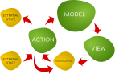

# About (not) using external state

Your application is, essentially, a view which is a function of the application
state. Application state is normally expressed as the application model, but
Duckweed won't prevent you from using some other source of state.

For the purpose of this guide, we use the terms 'external' state to mean 'state
that is not part of the model', and 'internal state' as 'state that is in the
model'.

## Why use external state?

Ideally, everything your application 'knows' about itself and the data user is
working with should be stored in the internal state, the model. This is ideal,
because the the views can be made pure (side-effect free), which immensely
simplifies our lives.

This is a topic that deserves an entire tome for itself, so we won't go into the
details, but remember that our goal is to make our views as pure as possible. By
keeping as much purity in the view as possible, we ensure that the views can be
easily tested, and will work *predictably*, resulting in much simpler code which
can be easily maintained and extended.

To put it shortly, for any given model state, the view should *always* render
the exact same VNODEs.

That is not always easy, however. There is always state that is maintained
elsewhere. For example, some state is maintained in a server-side database,
some of it may be found in `localStorage`, yet other state may be in the DOM
node properties. We need to work with the external state in all but the most
trivial apps.

If we want to stick to our ideal, we need a way of dealing with the external
state that does not cause the views to heavily depend on them.

## Internalizing the external state

We use actions to transform the model state between user interaction and
subsequent interface update.

To avoid having our views rely on external state, we internalize the external
state by making portions of it part of our model. This is done in the actions.
This is depicted in the following diagram:

Actions are triggered by event handlers, which, in turn, provide information
about the external state (e.g., current URL in the address bar, information
about the mouse cursor, etc.). Instead of performing the conversion at render
time, actions can convert such state into internal state and let the view work
with it.

Actions merge the internal and external state and may also affect the external
state while they're at it. Actions can fetch data from `localStorage` or perform
XHR requests in order to synchronize external and internal state.

This internalization of external state is very important when developing
Duckweed applications.

## An example

The [demo app](https://github.com/foxbunny/duckweed-tasks) contains an example
of external state being internalized in the model, so we'll use it as an example
in this guide.

The router in the Duckweed tasks app works by binding to the `route` event (see
the [Non-standard events](./non-standard-events.md#routing-events) guide). This
event provides information about the current route. It matches the look-up table
against the path provided by the route event and renders the matching view.

The
[router](https://github.com/foxbunny/duckweed-tasks/blob/master/src/routing/route-view.tsx)
does not *have* to use the data provided by the event handler. It could also
look up `window.location.pathname` to determine the matching module, but we went
a step further and made sure the lookup is only ever done through the data
provided by the event callback.

## The rule of the thumb

As a rule of the thumb, always work with arguments that are passed to your
function and nothing else.

Even if you absolutely have to use something like `location.pathname`, try
making that a default value of your function's parameter, and work with the
parameter instead. This is a good compromise because it allows us to override it
as needed (e.g., in tests).

[Documentation index](../main.md) | [Next topic](./middleware.md)
