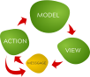

# Introduction to Model-Action-View

As in most web UI architectures, the Duckweed architecture allows us to model a
cycle between a rendered view, through events, to state updates.

The cycle is started by the runner based on the initial application state, **the
model**.

A **view** is a function that translates the application state to VNODE. Its
input is the model, and its output is a VNODE object, which specifies how the
interface should be rendered, and also how events should be translated into
messages.

Once a view is rendered, it will react to user input, and various other events
(hooks, navigation, etc.). Whenever an event happens, a **message** is
transmitted. The message consists of an address (action name), and arbitrary
data.

When the update function is invoked, it takes an **action** based on the
message's address. It also receives the message's data, and it can act on it.
Typically, an action modifies the application state by patching the model.

Besides patching the model, actions can also send messages, either synchronously
or asynchronously. This allows **action composition**.

In Duckweed, model patching is done by returning a modified copy of the model
which is to replace the existing model.

Once the model is modified, the cycle repeats.

[Documentation index](../main.md) | [Next topic](./composition.md)
