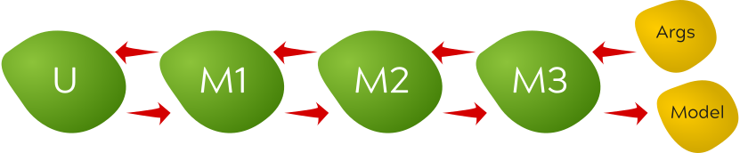

# Writing middleware functions

Middleware functions allow us to wrap the application's main update function.
This can be useful in various scenarios such as capturing the state before and
after an update, logging, handling exceptions, providing additional external
state information, and so on.

To register middleware functions, pass them as an array in the `middleware`
runner option:

```javascript
duckweed.runner(model, update, view, {
  middleware: [
    middleware1,
    middleware2,
    middleware3,
    // ....
  ],
});
```

Middleware functions are higher order functions that take a normalized update
function and return a normalized update function. A normalized update function
is like a normal update function, but its return value is always a two-tuple
(array with two members), where the first member is the model, and second member
is either `undefined`, an array representing a message, or a `Promise` object
that resolves to a message.

A typical middleware will:

- Receive the model and the message
- Optionally process the model and/or the message first
- Pass the model and the message to the updater
- Optionally process the returned model and/or the message
- Return the model and the message

Here's an example of a middleware that just logs every update when `DEBUG` flag
is set:

```javascript
const updateLogger = update => (model, ...message) => {
  const [model1, message1] = update(model, ...message);

  if (DEVELOPMENT) {
    if (model !== model1) {
      console.log(`UPDATE: ${message[0]}`, message, model, model1);
    } else {
      console.log(`NO UPDATE: ${message[0]}`);
    }
  }

  return [model1, message1];
};
```

Middleware functions are executed in the order in which they are listed. This
means that the first middleware function is the closest to the update function,
and the furthest from the arguments. Say we have three middleware functions,
`m1`, `m2`, `m3`. The flow of data through the middleware would would look like
this:



The best way to think about it is that middleware are in:

- reverse order for pre-processing arguments
- right order for post-processing return values

In most situations the order of the middleware doesn't matter. The only time the
order matters is two middleware functions touch the same values.

[Documentation index](../main.md) | [Next topic](./plugins.md)
